*This is WIP*

# ECCG

This document describes an **ECCG** (*Entity Component Composition Graph*), a variation on the **ECS** (*Entity Component System*) pattern that improves **data reuse** and **nested data composition** by *sacrificing certain aspects of data-oriented design*. 

It is likely that this structure exists already under a different name or in a nameless way in proprietary implementations, but I have not found any descriptions online.

An ECCG *could be* a good fit if:

* You need component reuse in an ECS
* You need to express types through composition in an ECS

An ECCG is *not* a good fit if:
* You have no patterns of component reuse
* You want to leverage data-driven performance characteristics of an ECS

This document describes the rationale and workings of an ECCG.

# Limitations of ECS

Invented in the gaming industry, an ECS is an ideal way to decouple different data structures and users of data types while still operating on a shared set of elements. Typically in a game engine your players or enemies might be entities, while your geometry, location and materials data might be stored in components. The ECS approach provides two main benefits over inheritance-based approaches: **decoupling** and **predictable memory layout**, these are perfect for complex game engines with many systems working on the same objects, and a need for high performance.

Recently though, ECS systems have been applied in a different way inside of (collections of) web services. Particularly in large companies, having a single data definition of an object results in incredibly complex data structures that are hard to evolve and manage,  because that one object must support all use cases. In such a setting an ECS can be applied to decouple systems and more easily share data, each service operates on specific subparts of data it knows but together the system can work on objects with a single identifier. One field where this is happening is in the AEC industry.

Specifically, the AEC industry is taking advantage of the **decoupling** of ECS to share ownership of entities between many stakeholders and compose the data of an entity collaboratively. What these new applications care less about is achieving high performance through a **predictable memory layout**, in practice this means that avoiding reference chasing does not have to be a primary goal of ECS in AEC. 

A new requirement that arises in AEC data is the reliance on data sharing through inheritance and typing, while an ECS is more focused on reducing reference chasing through duplication and composition. We can see this in the following two examples:

*Note: in all graphs, we will use green for entities, blue for components*

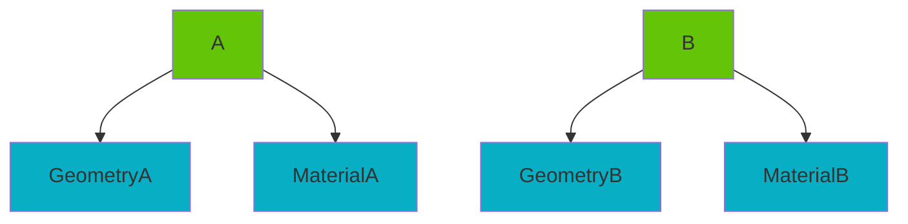
*Typing through duplication: the ECS can be queried naturally, but it's unclear which type an object belongs to, and no data is shared*

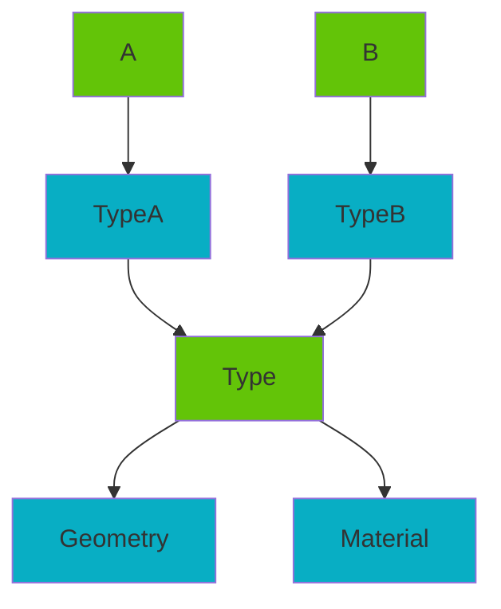
*Typing through relationships: it's clear which type the object belongs to, data is shared but not hierarchically, and querying objects through components returns types instead of instances, causing reference chasing on the client*

How can we improve on the typing capabilities in an ECS shown above, by taking advantage of the different requirements that AEC puts on its data? 

Specifically what we want from our ECS is:
* decoupling and shared ownership
* data composition
* normal ECS query behavior
* identifiable types
* data sharing

Meanwhile we don't need to consider:
* memory layout
* reference chasing

To find a sweet spot that balances these requirements, we need to take another look at composition.

# Composition graph

If we talk about a component that belongs to an entity, we can rephrase that to say that a component is *composed on* the entity. Adding a component to an entity could be described in pseudocode as:

``` Compose(entity, component) ```

For instance, in the AEC sector we would say:

``` Compose(wall, wallGeometry) ```

Removing it could similarly be done with a *decompose* operation.

Defining the operation like this invites the question of what would happen if we do:

``` Compose(entity, otherEntity) ```

By composing entities together like this we can imagine a graph is formed of composed entities and components. Let's call this the *compose graph*. The *compose graph* can be used to derive new functionality from the ECS. The compose graph, in combination with the ECS, form an ECCG.

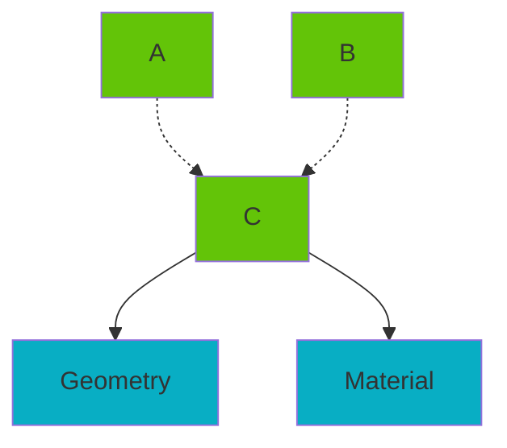
*An Entity Compose graph*

This graph does not feel fundamentally different than simple entity-to-entity relationships, but because entity composition is built into the system as a special type of connection we can treat it differently to get new behavior.

# Sub- and virtual entities

If we apply the following composition:

``` 
 Compose(B, Location)
 Compose(B, Geometry) 
 Compose(A, B) 
```

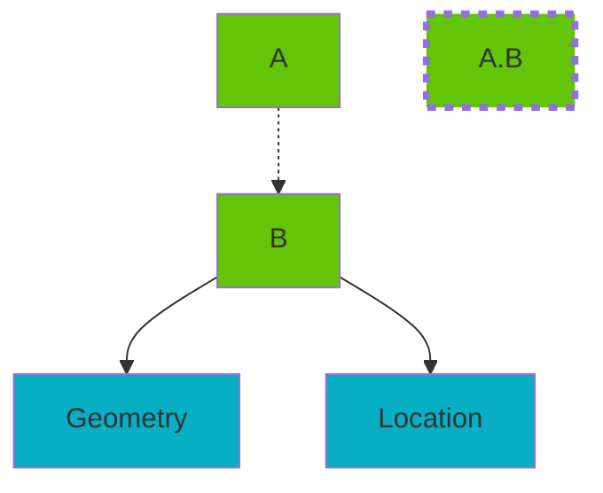

We have created two regular entities `A` and `B`. From the perspective of `A`, entity `B` is a **subentity**, but `B` is also a valid entity itself.

Additionally, a new entity is created implicitly which we can identify as `A.B`, we call this a **virtual entity**. It is virtual in the sense that it is not explicitly created but arises from the composition of `A` and `B`.

However, is `A.B` a valid entity in the same way that `A` and `B` are? What happens if we compose a component on `A.B`?

``` 
 Compose(A, Location)
 Compose(B, Geometry) 
 Compose(A, B) 
 Compose(A.B, Property) 
```

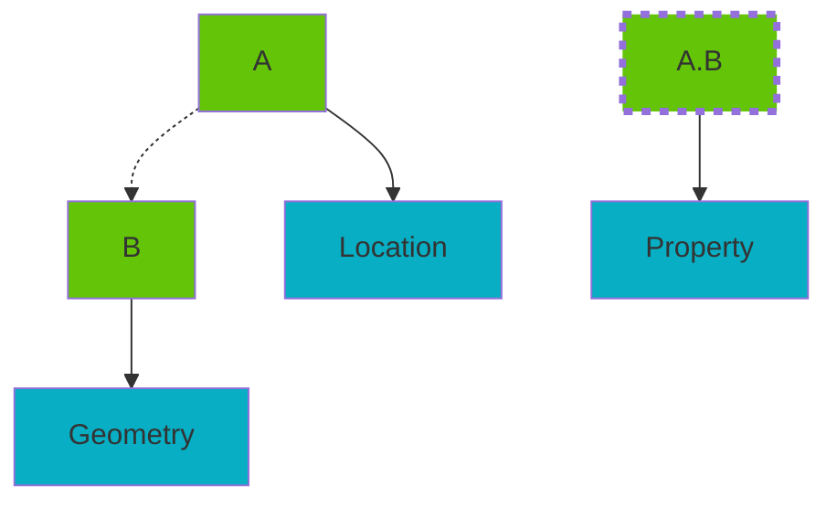

This example shows the **virtual entity** `A.B` is itself a valid entity in the sense that it can operate as a new entity under a new identifier separate from `A` and `B`, and can receive components itself.

This behavior can be nested further into the graph to form `A.B.C` or the graph can support multiple parents: `A.B` and `C.B` are both virtual entities that share the same data composed from `B` but can additionally receive their own specific components. This is where it becomes necessary to use the "full name" of the virtual entity to identify it, we call this the **entity path**.

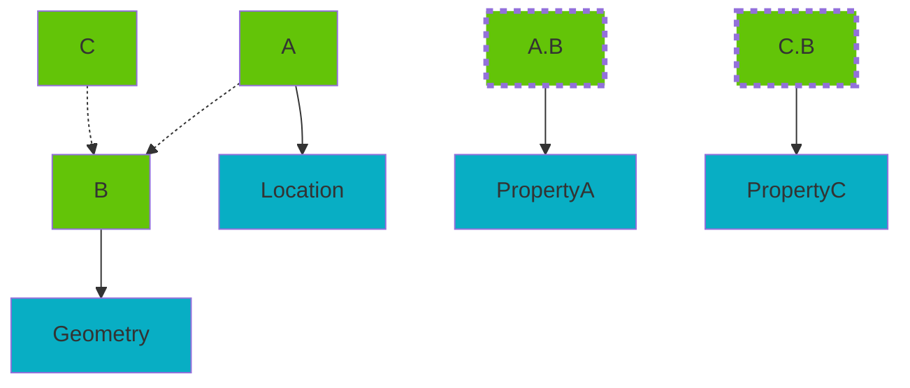
*Example with multiple entities sharing a subentity*

# Virtual entity lifecycle

Just like regular entities, virtual entities can be created and destroyed. A virtual entity `A.B` is created by calling `Compose(A, B)` and destroyed when calling `Decompose(A, B)`. All components composed on `A.B` are destroyed but `A` and `B` individually are not affected.

# Queries

This looks a lot like a regular inheritance hierarchy, so its important to examine how this can be used to answer queries on the data.

If we again take the following example

``` 
 Compose(A, Location)
 Compose(B, Geometry) 
 Compose(A, B) 
 Compose(A.B, Property) 
```


If we define an operation `Query(e)` that returns all components of entity `e`, and `Query(e.*)` that returns all components of the entire composition graph with root at `e`, we expect the following behavior:

```
 Query(A) -> 
    [Location]
 Query(B) -> 
    [Geometry]
 Query(A.B) -> 
    [Property]

 Query(B.*) -> 
    [Geometry]

 Query(A.B.*) -> 
    Query(A.B) && Query(B.*) -> 
        [Property, Geometry]
 
 Query(A.*) -> 
    Query(A) && Query(A.B.*) ->
        [Location, Geometry, Property]
```

Similarly, if we define an operation `Query(c)` that returns all entities with component type `c`, we expect the following behavior:

```
 Query(Location) ->
    [A]
    
 Query(Property) ->
    [A.B]

 Query(Geometry) ->
    [B, A.B]
```

Note that `A` is not returned for `Property` and `Geometry` because we know that `A` is involved through `A.B`. If `A` directly composed `Property` it should also be returned.

These query results show that entity composition extends component composition in a natural way for the client interacting with the ECCG.

# Relationships and the Compose graph

So far the described composition behavior did not include relationships: components that reference another entity ID. Luckily this works out without a lot of issues. We can distinguish three cases:

1. The relationship points **from inside to outside** the compose graph. In this case, the relationship works as any relationship in a traditional ECS.
2. The relationship points **from inside to inside** the compose graph. In this case, the relationship can be interpreted to link virtual entities together when viewed through the context of the parent entity. E.g a relationship pointing to `B` points to `A.B` when viewed from `A`.
3. The relationship points **from outside to inside** the compose graph, in this case, the relationship can simply use the entity ID path to express this. E.g pointing to `A.B` rather than `B` itself.

Some work must be done on the client side to properly interpret a relationship if it falls completely inside of a compose graph (case 2 above), or on the ECCG side to return rewritten relationships when part of a virtual entity. This is not particularly difficult in practice though. 

## Ownership and relationships

When sharing ownership over entities and their components, it's often necessary for many stakeholders to apply the same type of relationships to an entity. However, if this is the same relationship component having multiple entities it relates to, this creates an issue where stakeholders must agree on the same data. 

A solution is to allow multiple components of the same type, each component representing a single relationship, each stakeholder owning only the components it creates. This works for collaboration but creates a new problem of identification, if an entity has 5 components of the same type, how can we form a relationship to such a component?

The subentity and compose graph solution means keeping the single component type per entity requirement and using subentities to scope and identify the relationships.

# Overrides and defaults

The single component type per entity also allows us to derive another nice quality of the compose graph: overrides.

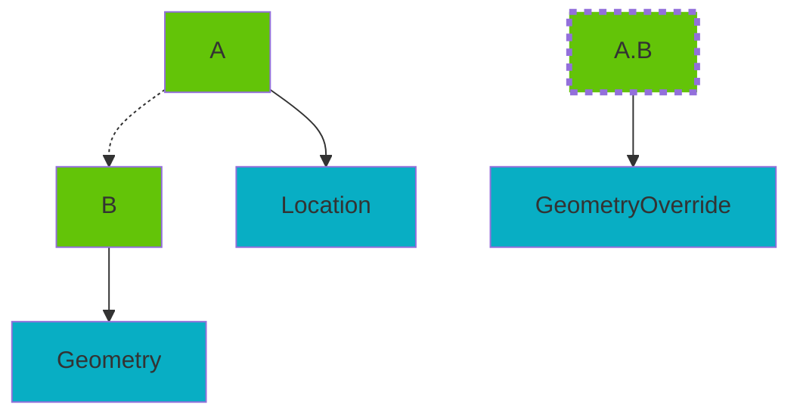

The client can conclude when `A.B.GeometryOverride` should take precedence over `B.Geometry` since depending on the query it is "more specific". When querying `B`, `GeometryOverride` is not considered as it is not in the compose graph of `B`. However when querying `A` it can be concluded that `A.B` has precedence over `B` from the perspective of `A`.

This way, a type can be implemented and partially overridden in edge cases where this is necessary while retaining shared ownership.

Similarly, one can think of a component that is NOT overridden as a guaranteed "default value". Hence you can think of a type not just as a concrete type but also as an arbitrary, to be filled in, set of components on an entity.

# Type systems in ECCG

This was a lot of theoretical operations, so now we can show how these operations can be combined to express common patterns that are hard to express in ECS.

Give a wall a type, the wall is in a specific place while the type defines geometry:

```
 Compose(Wall, Placement)
 Compose(WallType, Geometry)
 Compose(Wall, WallType)
```


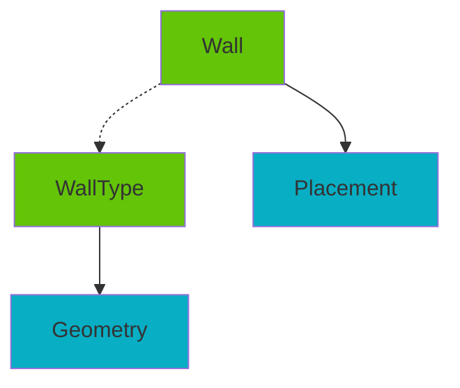

Querying the wall through `Query(Wall.*)` will return both the `Geometry` and `Placement`, allowing a viewer to visualize the wall at the correct location. 

Furthermore, another stakeholder may augment the `WallType` with some property

```
 Compose(WallType, FireRating)
```

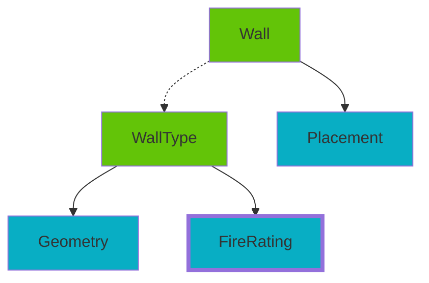

Without having to modify individual `Wall` entities, or even without having to know about any existing `Wall` entities.

If necessary, a stakeholder can identify an individual `Wall` as having additional data associated with its type that does not apply to all walls of that type.

```
 Compose(Wall.WallType, IsExternal)
```

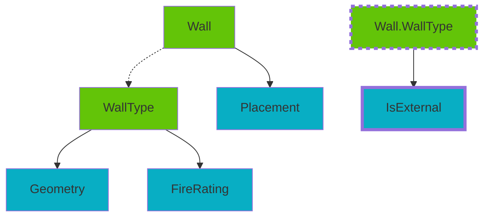

Another stakeholder looking for external walls would then find `Wall.WallType` through `Query(IsExternal)` and understand that `Wall` is an external wall without traversing or knowledge of the relationships on `Wall`.


# Archetypes

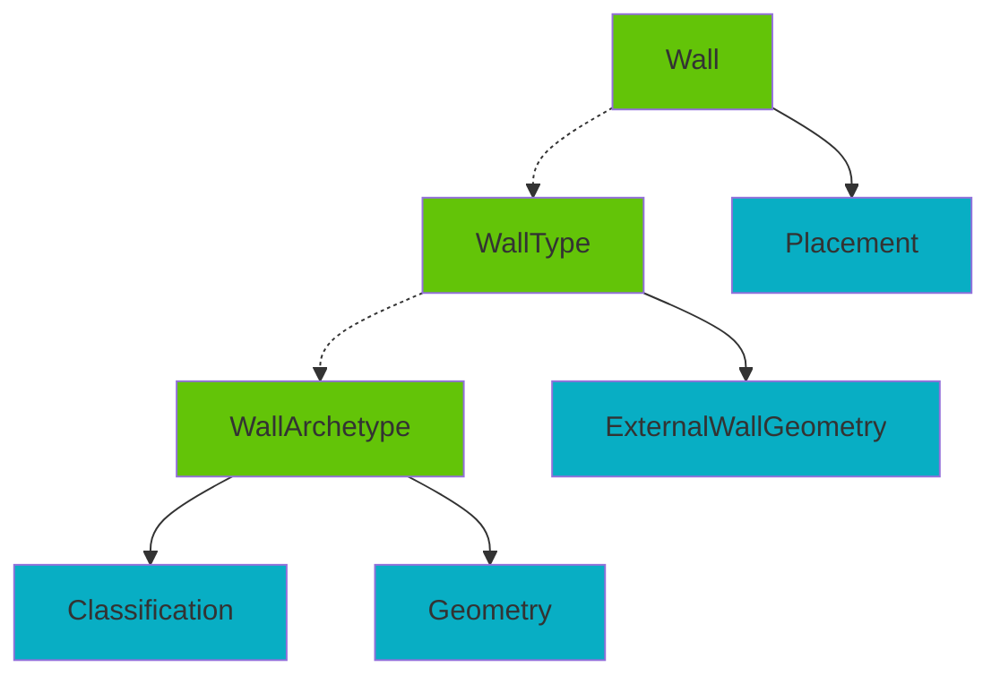

// querying composed entities through subentity

// 